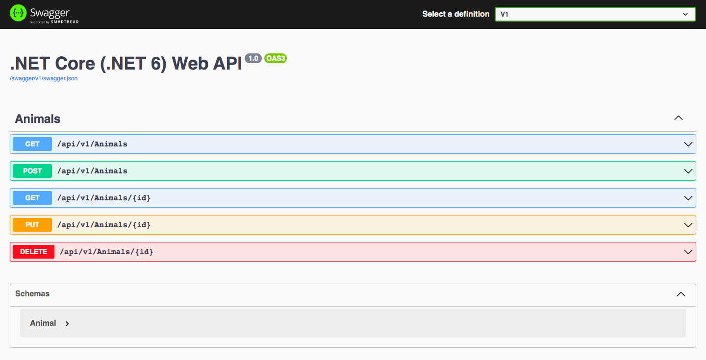

# Animal Shelter API

A web API to view adoptable cats and dogs at an animal shelter.

#### *By Najma Abdi*

&nbsp;

## Technologies Used
* C#
* ASP.NET Core
* Swagger
* Swashbuckle
* EF Core Migrations
* EF Core
* OpenAPI
* mySQL
* MySQLWorkbench

## Description

An Animal Shelter API that displays adoptable pets through RESTful routing, Swagger UI, and API versioning.

## Installation Requirements 
You must make sure the following software packages are locally installed in order to use this application:
- A preferred code editor *(my case: VS Code)*
- .NET6
- MySQL and MySQL workbench

## Setup

- Clone the repository.
- Launch the terminal and go to the "AnimalShelterApi" production directory for this project.
- Create a new appsettings.json file in the "AnimalShelterApi" production directory.
- Launch a code editor, then go to appsettings.json.
- Insert the following code in appsettings.json, substituting the values in the brackets with your personal MySQL username and password.

<pre>{  
  "ConnectionStrings": {  
    "DefaultConnection": "Server=localhost;Port=3306;database=jase_seeley;uid=[YOUR-USERNAME-HERE];pwd=[YOUR-PASSWORD-HERE];"  
  }  
}</pre>

- Save and add this file in your .gitignore, along with obj and bin files.

## Import the Database

- To create the database and schema on mySQL Workbench, run "dotnet ef update database". The migration files generated will give the necessary data.

## Run the API:
- Go to the "*AnimalShelterApi*" project directory.
- To install the necessary packages, run "*dotnet restore*".
- To build the project, run "*dotnet build*".
- Run "*dotnet watch*" or "*dotnet run*" and go to *http://localhost:5000/swagger* in your browser or *Postman* to access the API endpoints. Easier option would be Swagger.

     - A form will appear when one of the routes is clicked. To submit your request, click the "*Try it out*" button, complete any necessary fields, and then click "*Execute*". 
- When finished, close the API by pressing "*CTRL + C*".
 

## API Versioning
- The technique of assigning a unique identification or version number to a specific release of an API is known as API versioning. When an API is altered or updated, it may disrupt compatibility with existing clients, causing issues for API users. Developers can ensure that clients can continue to utilize the previous version of the API if necessary, while also allowing new clients to take use of the new features in the upgraded version by versioning the API.
  - With Swagger, you'll be given the option to select a version at the top right corner.

## API Endpoints 
### GET: */api/v1/animalshelterapi/animals*
* This URL will provide a full list of available cats and dogs.
* You will be utilizing the following search queries:   
*species, name, minimumAge, minimumAge, gender, breed*<ul>
* Add a *question mark, the name of the query, and '='* at the end of the URL after your particular search to sort through the results:
    - Example: *http://localhost:5000/api/animalshelterapi/animals?species=cat* 

### POST: */api/v1/animalshelterapi/animals*
* To add a new animal to the database, you will need to make a POST request. Copy and paste the following code into the body of your request and change the values:
<pre>{
  "species": "string",
  "breed": "string",
  "name": "string",
  "gender": "string",
  "age": 0
}</pre>

### GET: */api/v1/animalshelterapi/animals/{id}*
* Add the ID number of the requested entry to the end of the URL to get one animal:  
  - Example: *http://localhost:5000/api/animalshelterapi/animals/2*

### PUT: */api/v1/animalshelterapi/animals/{id}*
* You must submit a PUT request if you want to change an animal's data. Change the relevant fields in the request body and add the animal ID number to the end of the URL.   
  - Ex: *http://localhost:5000/api/animalshelterapi/animals/2*   
    <pre>{
      "animalId": 1,
      "species": "Cat",
      "breed": Siamese,
      "name": "Catalina",
      "age": 4,
      "gender": "Female"
    }</pre>

### DELETE */api/v1/animalshelterapi/animals/{id}*
* Add the animal's ID number to the end of the URL and send a DELETE request to remove the animal from the database.  
  - Ex: *http://localhost:5000/api/animalshelterapi/animals/2* 

&nbsp;

## Known Bugs

*None*

&nbsp;

# License

MIT License

Copyright (c) [2023] [Najma Abdi]

Permission is hereby granted, free of charge, to any person obtaining a copy of this software and associated documentation files (the "Software"), to deal in the Software without restriction, including without limitation the rights to use, copy, modify, merge, publish, distribute, sublicense, and/or sell copies of the Software, and to permit persons to whom the Software is furnished to do so, subject to the following conditions: